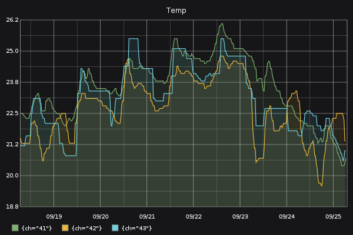

# prometheus-png

PNG renderer for [prometheus](https://github.com/prometheus/prometheus) based on [carbonapi](https://github.com/go-graphite/carbonapi)


## Example
```
http://localhost:8080/?query=min(noolite_rx_sensor_temp_celsius)by(ch)&from=-7d&width=600&height=400&areaMode=all&areaAlpha=0.09&title=Temp&bgcolor=161619&colorList=7EB26D,EAB839,6ED0E0,EF843C,E24D42,1F78C1,BA43A9,705DA0,508642,CCA300,447EBC,C15C17,890F02,0A437C,6D1F62,584477,B7DBAB,F4D598,70DBED,F9BA8F,F29191,82B5D8,E5A8E2,AEA2E0,629E51,E5AC0E,64B0C8,E0752D,BF1B00,0A50A1,962D82,614D93,9AC48A,F2C96D,65C5DB,F9934E,EA6460,5195CE,D683CE,806EB7,3F6833,967302,2F575E,99440A,58140C,052B51,511749,3F2B5B,E0F9D7,FCEACA,CFFAFF,F9E2D2,FCE2DE,BADFF4,F9D9F9,DEDAF7
```


## Run
```
docker run --rm -p 8080:8080 lomik/prometheus-png:latest -prometheus "http://127.0.0.1:9090/"
```

## Command line options
```
Usage of ./prometheus-png:
  -listen string
    	Listen addr (default ":8080")
  -prometheus string
    	Prometheus addr (default "http://127.0.0.1:9090")
  -prometheus.path string
    	Path to query_range endpoint (default "/api/v1/query_range")
  -timeout duration
    	Default timeout for queries (default 10s)
```

## URI Parameters
* **g0.expr**, **g1.expr**, ..., **gN.expr** - prometheus queries
* **g0.legend**, **g1.legend**, ..., **gN.legend** - custom legend [template](https://golang.org/pkg/text/template/). Tag values can be printed with {{.tagname}} instruction
* **query** - alias for g0.expr
* **timeout** - optional custom query timeout
* [all GET-parameters from carbonapi for format=png](https://github.com/go-graphite/carbonapi/blob/master/cmd/carbonapi/COMPATIBILITY.md#render)

## Build
```
git clone https://github.com/lomik/prometheus-png.git
cd prometheus-png
make
```

## Build macOS
```
brew install Caskroom/cask/xquartz
brew install cairo --with-x11
export PKG_CONFIG_PATH=/opt/X11/lib/pkgconfig
git clone https://github.com/lomik/prometheus-png.git
cd prometheus-png
make
```
