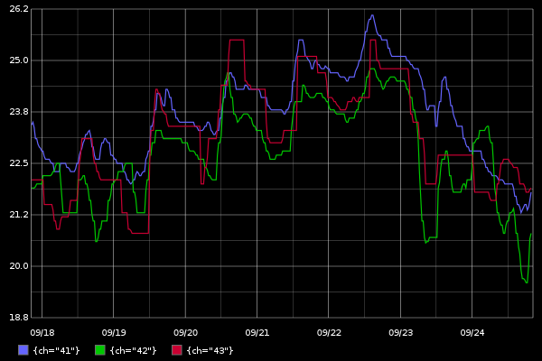

# prometheus-png

Simple PNG renderer for [prometheus](https://github.com/prometheus/prometheus) based on [carbonapi](https://github.com/go-graphite/carbonapi)


## Example
```
http://localhost:8080/?query=min(noolite_rx_sensor_temp_celsius)by(ch)&from=-7d&width=600&height=400
```


## Run
```
docker run --rm -p 8080:8080 lomik/prometheus-png:latest -prometheus "http://127.0.0.1:9090/"
```

## Command line options
```
Usage of ./prometheus-png:
  -listen string
    	Listen addr (default ":8080")
  -prometheus string
    	Prometheus addr (default "http://127.0.0.1:9090")
  -prometheus.path string
    	Path to query_range endpoint (default "/api/v1/query_range")
  -timeout duration
    	Default timeout for queries (default 10s)
```

## URI Parameters
* **query** - prometheus query
* **timeout** - optional custom query timeout
* [all GET-parameters from carbonapi for format=png](https://github.com/go-graphite/carbonapi/blob/master/cmd/carbonapi/COMPATIBILITY.md#render)

## Build
```
git clone https://github.com/lomik/prometheus-png.git
cd prometheus-png
make
```

## Build macOS
```
brew install Caskroom/cask/xquartz
brew install cairo --with-x11
export PKG_CONFIG_PATH=/opt/X11/lib/pkgconfig
git clone https://github.com/lomik/prometheus-png.git
cd prometheus-png
make
```
